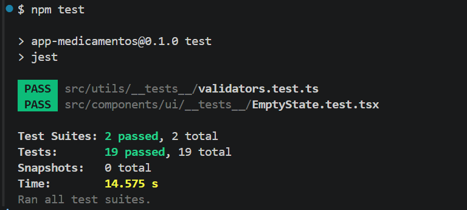
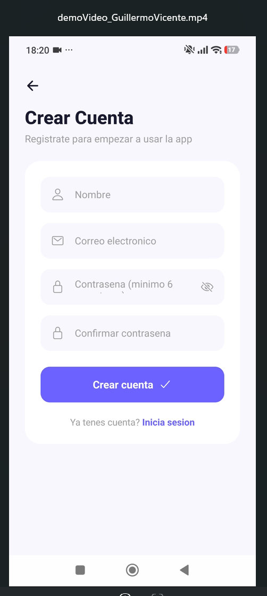
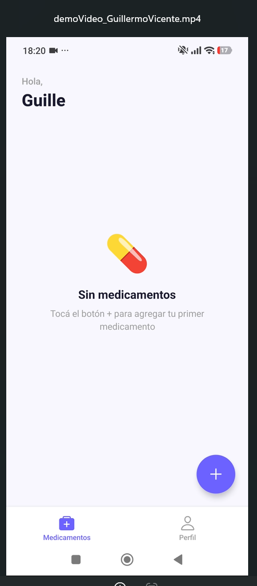
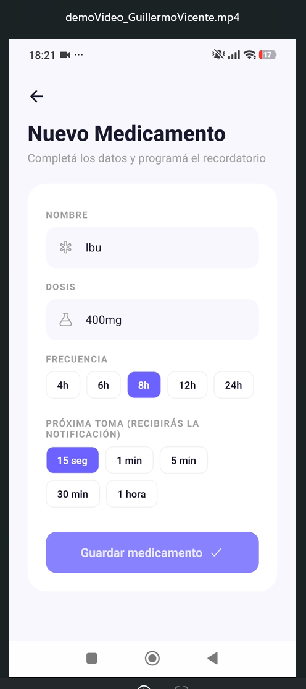
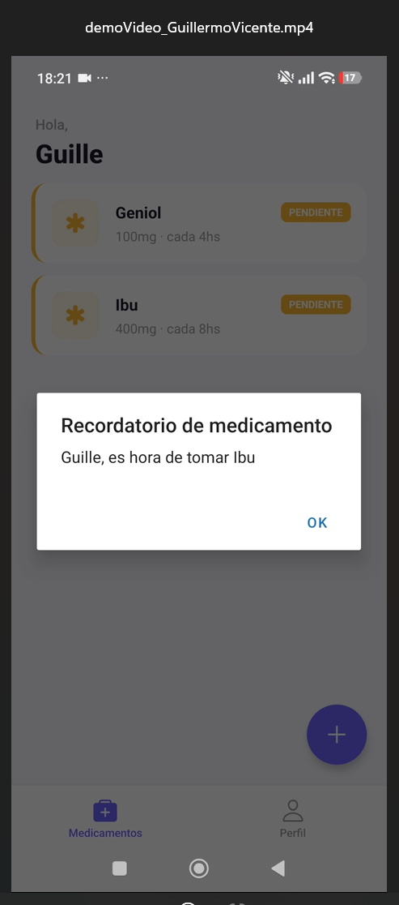
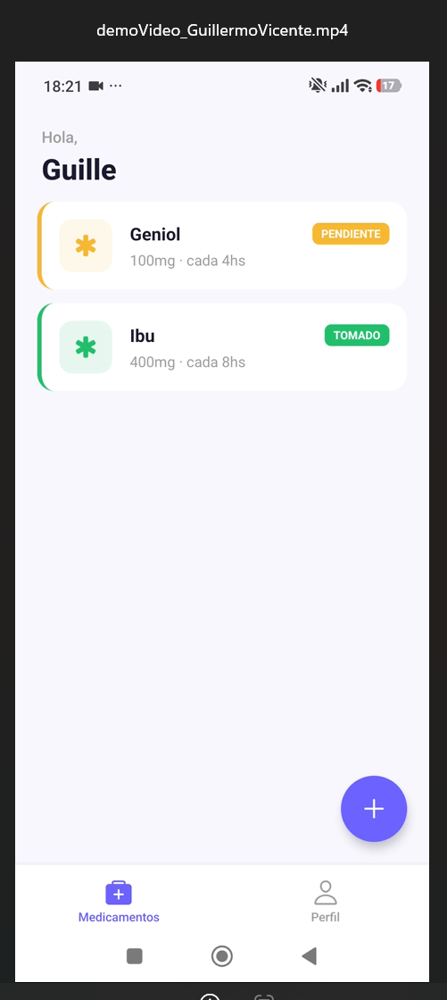
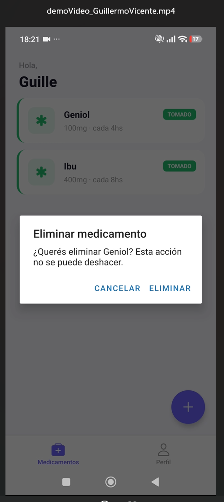
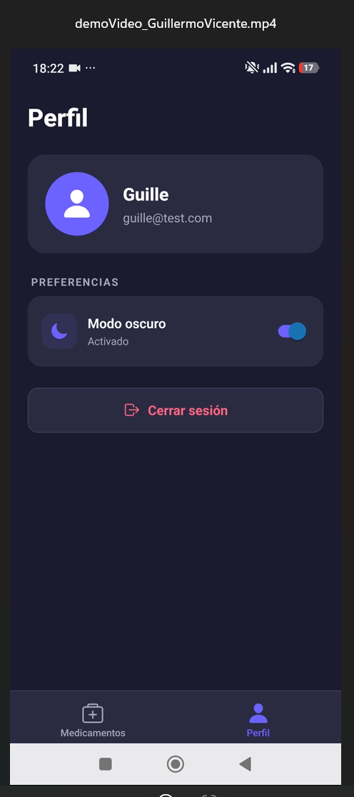

**Tecnicatura Superior en Desarrollo de Software**  
**Materia:** Aplicaciones Móviles  
**Institución:** ISTEA  
**Alumno:** Guillermo Eduardo Vicente  
**Profesor:** Martín Cornejo  

---

# MediRecordatorio

**App de recordatorio de medicación** desarrollada como Parcial 1 de la materia **Aplicaciones Móviles** (ISTEA — 2do año, 2026).

Stack: **Expo SDK 57 · React Native 0.86 · React 19 · TypeScript 6**

---

## Opción elegida

De las 5 opciones propuestas en el parcial, elegí **Recordatorio de medicación**:

> Permitir al usuario registrar medicamentos, programar recordatorios y marcar tomas como completadas.

---

## Instalación y ejecución

### Requisitos previos

- **Node.js 18+** (recomendado 22)
- **Expo Go** instalado en el celular (Android o iOS) — [Play Store](https://play.google.com/store/apps/details?id=host.exp.exponent) / [App Store](https://apps.apple.com/app/expo-go/id982107779)
- PC y celular en **la misma red WiFi**

### Pasos

```bash
# 1. Clonar el repositorio
git clone https://github.com/guillermo-vicente/medi-recordatorio.git
cd medi-recordatorio

# 2. Instalar dependencias
npm install

# 3. Levantar el proyecto
npx expo start --clear

# 4. Escanear el QR con Expo Go desde el celular
```

> **Alternativa si hay problemas de red local:**
> ```bash
> npx expo start --clear --tunnel
> ```

### Correr los tests

```bash
npm test
```

Resultado esperado:

```text
PASS  src/components/ui/__tests__/EmptyState.test.tsx
PASS  src/utils/__tests__/validators.test.ts

Test Suites: 2 passed, 2 total
Tests:       19 passed, 19 total
```

### Captura de resultado de los tests en consola



---

## Funcionalidades

### Autenticación local

- Registro con nombre, email y contraseña (validación de formato y coincidencia).

- Login con validación de credenciales contra los usuarios guardados en el dispositivo.

- Sesión persistente: el token se guarda cifrado en SecureStore (Keychain iOS / Keystore Android).

- Bloqueo de acceso: no se puede entrar sin loguearse.

### Gestión de medicamentos

- Alta de medicamentos con nombre, dosis, frecuencia (4h / 6h / 8h / 12h / 24h) y próxima toma.

- Lista con estado por medicamento (pendiente / tomado) con colores.

- Marcar como tomado con un toque.

- Eliminar medicamento con confirmación.

- Persistencia en AsyncStorage, aislada por usuario.

### Notificaciones locales

- Se programa una notificación personalizada con el nombre del usuario y el medicamento al dar de alta.

- Permisos solicitados al usuario en el primer uso.

- Cancelación automática al cerrar sesión (evita alertas del usuario anterior).

### Tema claro / oscuro

- Detecta automáticamente el tema del sistema operativo.

- Toggle manual desde el Perfil.

- Sincronización con React Native Paper.

### Cobertura de testing

- 19 tests unitarios con Jest + React Native Testing Library.

    * Tests de funciones puras (validadores de login y registro).

    * Tests de componente reutilizable (EmptyState).

---

## Capturas

### Autenticación

| Login | Registro |
|---|---|
|  |  |

### Home y alta de medicamento

| Home vacío | Nuevo medicamento |
|---|---|
|  |  |

### Notificaciones y estado de tomas

| Notificación personalizada | Medicamento tomado |
|---|---|
|  |  |

### Eliminar y perfil

| Confirmar eliminación | Perfil con modo oscuro |
|---|---|
|  |  |

---

## Estructura del proyecto

```text
AppMedicamentos/
├── app/                          # Rutas (Expo Router, file-based)
│   ├── _layout.tsx               # Stack raíz + Providers (SafeArea, Theme, Auth)
│   ├── index.tsx                 # Login
│   ├── register.tsx              # Registro
│   ├── medicamento/
│   │   └── nuevo.tsx             # Alta de medicamento con notificación
│   └── (tabs)/                   # Grupo de tabs
│       ├── _layout.tsx           # Tab Navigator
│       ├── home.tsx              # Lista de medicamentos
│       └── profile.tsx           # Perfil + toggle tema + logout
│
├── src/                          # Código de la app (no rutas)
│   ├── components/ui/            # Componentes presentacionales reutilizables
│   │   ├── EmptyState.tsx
│   │   ├── ErrorState.tsx
│   │   ├── LoadingState.tsx
│   │   └── __tests__/
│   │       └── EmptyState.test.tsx
│   ├── config/
│   │   └── constants.ts          # Estados, frecuencias, claves de storage
│   ├── features/
│   │   ├── auth/                 # AuthContext + useAuth
│   │   ├── medicamentos/         # medicamentoService + useMedicamentos
│   │   └── notifications/        # notificationService
│   ├── services/
│   │   ├── storage.ts            # Wrapper de AsyncStorage
│   │   └── secureStorage.ts      # Wrapper de SecureStore (mobile) / localStorage (web)
│   ├── theme/
│   │   ├── ThemeContext.tsx      # Provider del tema claro/oscuro
│   │   └── useTheme.ts           # Hook con la paleta de colores
│   └── utils/
│       ├── validators.ts         # Funciones puras de validación
│       ├── dialogs.ts            # Diálogos cross-platform
│       └── __tests__/
│           └── validators.test.ts
│
├── app.json                      # Configuración de Expo
├── package.json                  # Dependencias + scripts
├── tsconfig.json                 # Configuración de TypeScript
└── babel.config.js               # Configuración de Babel
```

---

## Stack y dependencias

| Paquete | Versión | Para qué |
|---|---|---|
| `expo` | `~57.0.25` | Framework base |
| `react-native` | `0.86.3` | Framework mobile |
| `react` | `19.2.3` | Librería de UI |
| `expo-router` | `~57.0.23` | Navegación basada en archivos (sobre React Navigation) |
| `@react-native-async-storage/async-storage` | `2.2.0` | Persistencia de datos locales |
| `expo-secure-store` | `~57.0.4` | Token cifrado en Keychain/Keystore |
| `expo-notifications` | `~57.0.21` | Notificaciones locales |
| `@expo/vector-icons` | `^15.0.3` | Íconos (Ionicons) |
| `react-native-paper` | `^5.15.0` | Componentes Material Design |
| `jest-expo` | `~57.0.5` | Preset de Jest para Expo |
| `@testing-library/react-native` | `^14.0.1` | Testing de componentes |

---

## Video demo

**[Ver video demo en YouTube](https://youtube.com/shorts/JA4iC77T3zY)**

Duración: 1:50.

Muestra el flujo completo: login → alta de medicamento → notificación personalizada → marcar tomado → modo oscuro.

## Notas técnicas

### Navegación con Expo Router

El proyecto usa expo-router, que es la capa oficial de navegación de Expo y está construida sobre React Navigation (@react-navigation/native-stack por debajo). Aporta file-based routing: cada archivo en app/ es una ruta automáticamente.

### Notificaciones locales en Expo Go Android

El proyecto usa expo-notifications con un fallback con Alert.alert cuando el módulo nativo no está disponible, manteniendo la funcionalidad del recordatorio en Expo Go. En iOS o en un development build la notificación nativa se dispara normalmente.

### Aislamiento de datos por usuario

Cada medicamento guarda el userEmail del usuario que lo creó. El servicio filtra por ese email, por lo que cada cuenta ve únicamente sus propios medicamentos.

### Testing (notas técnicas)

- **Funciones puras** (`validators.ts`): validan formato de email, longitud de contraseña y coincidencia de campos.
- **Componente reutilizable** (`EmptyState.tsx`): verifica renderizado de título, subtítulo y emoji.
- Ejecutar con: `npm test`.